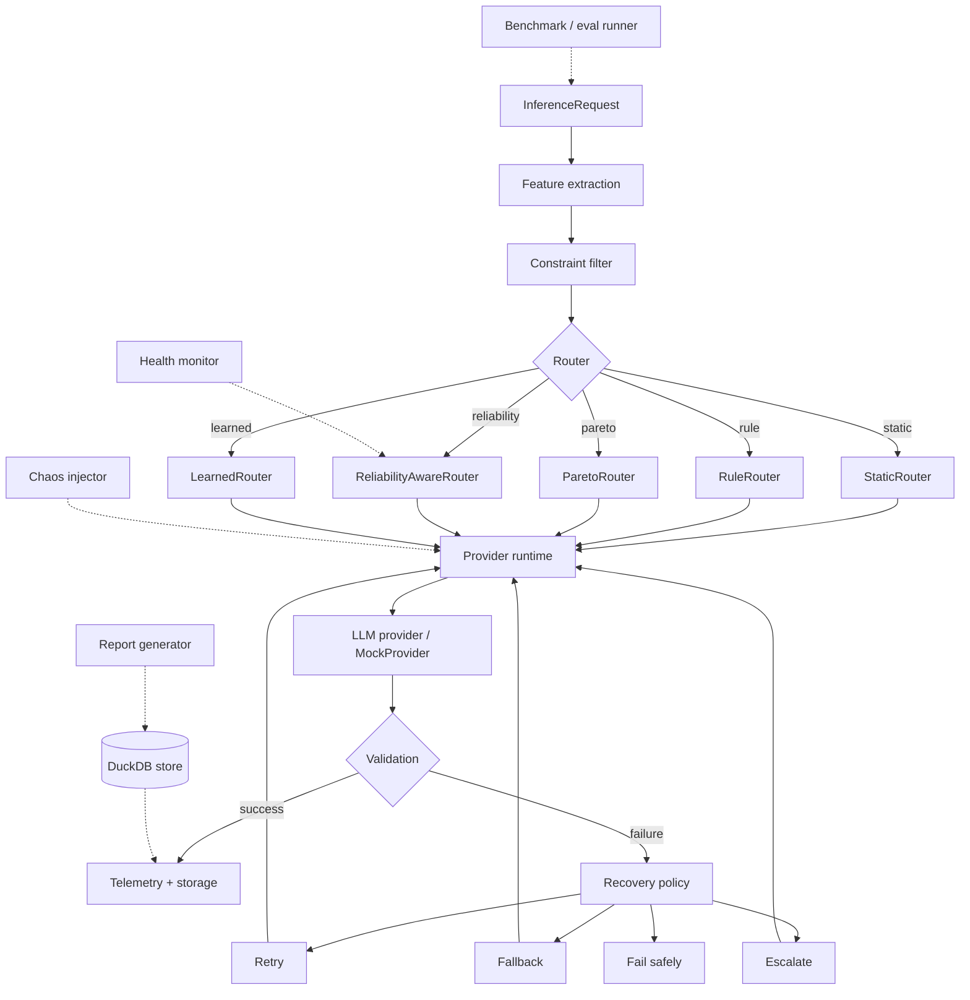

# ParetoGuard

A reproducible experimental framework for evaluating multi-model AI systems under
quality, cost, latency, reliability, and provider-health constraints.

> Benchmark models. Route under constraints. Inject failures. Measure recovery.
> Report the results — including the ones that don't flatter any particular policy.

**Status: v0.1, feature-frozen.** The experimental core (providers, routing, chaos
injection, recovery, statistics, reporting) is complete and tested. A CLI, HTTP
service, and dashboard are deliberately not built yet — see
[Project status](#project-status).

## Why

Production LLM applications rarely benefit from sending every request to one fixed
model. Tasks differ in required reasoning quality, structured-output reliability,
tool-use reliability, cost, latency, and context length — and providers themselves
fail: rate limits, 5xx errors, timeouts, malformed output, degraded availability.

ParetoGuard exists to measure those trade-offs and failure modes under controlled,
reproducible conditions, rather than assuming a fixed "best" model or trusting
anecdotal reliability claims. It supports controlled experiments around:

- multi-provider abstraction (OpenAI / Anthropic / Gemini adapters + a deterministic
  mock provider for offline work)
- routing (static, rule-based, Pareto-constrained, reliability-aware, learned)
- deterministic evaluation (versioned task suites, deterministic graders, repeated
  trials)
- provider/tool failure injection (seeded, inspectable chaos — never random or
  wall-clock-dependent)
- retry / fallback / circuit-breaker / escalation recovery policies
- closed-loop reliability evaluation (routing → execution → recovery → outcome, as
  one automatically-driven control loop)
- statistical comparison, regression detection, and reproducible reporting

### The questions this project investigates

- When does fallback actually outperform retry — and when does it merely tie it?
- How does the *shape* of a failure process (independent vs. sustained/correlated)
  change which recovery policy wins?
- When does a circuit breaker help, and when is it neutral or actively harmful?
- How should provider health influence fallback ordering without silently excluding
  a candidate that's still the only option?
- What is the quality/cost/latency trade-off between candidate models, and can it be
  represented as a Pareto frontier rather than a single "best" pick?
- Can routing and recovery policies be evaluated reproducibly, with honest
  statistical uncertainty, rather than from a single anecdotal run?

## What this is not

- **Not a production reliability guarantee.** Almost all reliability evidence in this
  repository comes from a deterministic mock provider and seeded synthetic fault
  injection — see [Simulation provenance](#simulation-provenance).
- **Not a SaaS, dashboard, or deployed service.** There is no HTTP API, CLI, or UI
  yet (Phase G, not started — see [Project status](#project-status)).
- **Not a generic chatbot or agent framework.** The agent simulator exists to
  generate controlled multi-step tool-use trajectories for evaluation, not as a
  general-purpose agent runtime.
- **Not proof that any one LLM or provider is universally superior.** Real-provider
  adapters exist for I/O normalization; no live-provider benchmark has been run or
  claimed.

## Architecture



A few boundaries are load-bearing and deliberately kept separate — conflating any of
them has been a real bug in this codebase at some point (see
[docs/LIMITATIONS.md](docs/LIMITATIONS.md)):

- **Routing != Recovery** — a `Router` is consulted once per task to pick the first
  candidate; every subsequent switch is a `RecoveryPolicy` decision, not a new
  routing decision.
- **Runtime retry != Recovery retry** — `paretoguard.runtime.Runtime` retries a
  transient transport failure within one call; `paretoguard.recovery` decides what
  happens *after* a call has already returned a final failed response.
- **Health != Circuit breaker** — `HealthTracker`/`recovery.health` softly reorder
  fallback candidates from rolling signals; `CircuitBreaker` is a separate hard
  CLOSED/OPEN/HALF_OPEN state machine. Neither one silently excludes a candidate that
  is the only option left.
- **Simulation != Live provider evidence** — see
  [Simulation provenance](#simulation-provenance).
- **Estimated cost != provider-reported cost** — a `CostRecord`'s `basis` field is
  always `ESTIMATED` or `SIMULATED`, never presented as an authoritative invoice;
  missing cost data stays `None`, never a fabricated `$0.00`.

Full module boundaries, responsibilities, and "must not do" constraints are in
[docs/ARCHITECTURE.md](docs/ARCHITECTURE.md).

## Quickstart

No API keys, no paid provider access, no network calls. Everything below runs
against a deterministic `MockProvider`.

```bash
uv sync
uv run python scripts/demo_benchmark.py
```

This runs four evaluation suites end to end (manifest → execution → grading →
DuckDB persistence → metrics computed from the persisted rows, not from in-memory
objects), including a couple of deliberately-injected failures to prove failed
attempts stay inspectable. It prints a pass/fail summary with no setup required
beyond `uv sync`.

Then run the test suite yourself:

```bash
uv run pytest tests/unit -v
```

## Reproducing the flagship experiment

```bash
uv run python scripts/phase_f_report.py
```

This exercises the full routing → chaos → recovery → statistics → reporting
pipeline end to end and writes everything to `scripts/phase_f_results/`:

- a persisted DuckDB experiment store (`phase_f_experiment.duckdb`, gitignored —
  regenerated by the script, not shipped in the repo)
- `flagship_summary.json` — every experiment's raw numbers
- `report.md` / `report.json` — a generated benchmark report for one comparison,
  built entirely from the persisted store (not from in-memory objects), including a
  statistical significance test against a baseline
- four charts (`charts/*.png`) — resilience curve, recovery-rate-by-level, recovery
  action distribution, baseline-vs-candidate comparison

Every artifact this produces is labeled `SIMULATION` — in the Markdown banner, in the
JSON manifest, and stamped directly into the chart pixels — because none of it is
real-provider performance. See [Simulation provenance](#simulation-provenance).

The committed copies of these artifacts under `scripts/phase_f_results/` reflect one
specific run; re-running will reproduce identical seed-derived numbers but a new
timestamp and new wall-clock latency values (see
[Reproducibility](#reproducibility)).

## Representative findings

These are observations under this project's own synthetic benchmark conditions —
seeded `MockProvider` behavior and seeded fault injection — not claims about any real
LLM provider's reliability.

1. **Under independent (i.i.d.) per-attempt faults, retry-only can tie
   fallback-capable policies.** In the `resilience_v1` flagship comparison, retry,
   retry+fallback, retry+fallback+circuit-breaker, and the full policy all reach
   1.000 task success at every tested fault level (0–30%) — they differ in *how*
   (average attempts), not in final success rate.
2. **Under a sustained, correlated outage, fallback becomes materially useful.**
   When one candidate degrades for an extended window instead of failing
   independently per attempt, no-recovery's success during the outage collapses to
   0.19 and retry-only only partially compensates (0.48) — while every
   fallback-capable config reaches 1.00 by routing around the degraded candidate.
3. **Circuit breakers are not universally beneficial, and depend on temporal
   semantics.** In the sustained-outage run, the circuit-breaker config performs
   identically to plain fallback — no additional benefit. At a larger sample size
   under the i.i.d. model, circuit breakers measurably *hurt*: a shared breaker's
   cooldown window didn't have a realistic chance to elapse within a fast synthetic
   run, so a tripped circuit could stay open for the rest of it (documented in
   [docs/LIMITATIONS.md](docs/LIMITATIONS.md)).
4. **Quality validation + escalation recovers controlled quality failures, at a real
   cost.** Validating responses in-loop and escalating on schema failures recovered
   100% of an injected quality fault (0.35 → 1.00 task success) — at a measured cost
   of +0.65 average attempts per task. Escalation is not presented as free.

**The thesis these support**: a recovery policy's effectiveness depends on the shape
of the failure process it's actually facing, not just its own sophistication —
which is why this project evaluates policies under more than one fault model instead
of reporting a single "winner."

### Negative findings

Reported deliberately, not tuned away:

- Retry-only ties every more sophisticated policy under i.i.d. faults — fallback and
  circuit-breaking buy nothing in that specific regime.
- A circuit breaker measurably *reduced* success rate at a larger sample size under
  the i.i.d. model, due to a cooldown-vs-execution-speed mismatch, not a flaw in the
  policy's logic.
- Escalation's quality-recovery benefit comes with a non-trivial attempt-count cost,
  not just a latency footnote.
- Several real bugs (a fallback-depth accounting error, a request-ID
  non-determinism, a missing experiment manifest across benchmark entry points, an
  invalid-UTF-8 report write on Windows) were found only by actually running
  end-to-end experiments, not by unit tests alone — documented with root cause in
  [docs/LIMITATIONS.md](docs/LIMITATIONS.md) rather than quietly fixed.

## Simulation provenance

Nearly all reliability/recovery evidence in this repository comes from
`MockProvider` plus deterministic, seeded fault injection — **not** real OpenAI,
Anthropic, or Gemini traffic. Real-provider adapters exist (for request/response
normalization) but no committed experiment calls them; nothing in this repository
has ever spent API credits.

Every generated report, JSON artifact, and chart carries an explicit `SIMULATION` or
`LIVE` label (`RunManifest.label`), and comparing a simulation run against a live run
requires an explicit opt-in (`allow_simulation_vs_live=True`) rather than happening
silently. See [docs/REPRODUCIBILITY.md](docs/REPRODUCIBILITY.md) for exactly how this
is enforced, and [§13 below](#future-live-provider-validation-not-implemented) for
what a future live-provider validation would look like.

## Reproducibility

- Every chaos/bootstrap/request-ID decision is derived from an explicit seed — never
  a random UUID, global random state, or wall-clock time.
- `FaultInjector` decisions are a pure function of `(seed, task_id, step, fault_id)`.
- Bootstrap confidence intervals use an explicitly-seeded `numpy.random.Generator`,
  never global RNG state.
- The one deliberate exception is wall-clock-derived fields (latency measurements,
  `created_at` timestamps) — re-running the flagship script reproduces identical
  seed-derived results (success rates, recovery rates, p-values, effect sizes) but
  new timestamps and new latency numbers. This repository does not claim
  byte-for-byte reproducibility of artifacts containing those fields, and says so
  explicitly where it matters.

Full details, including how this is verified (cross-process reruns, not just
in-process), are in [docs/REPRODUCIBILITY.md](docs/REPRODUCIBILITY.md).

## Documentation

| Doc | Covers |
|---|---|
| [docs/ARCHITECTURE.md](docs/ARCHITECTURE.md) | Module boundaries, data flow, what each module must not do |
| [docs/EVALUATION.md](docs/EVALUATION.md) | Task schema, suites, graders, benchmark orchestrators, metrics |
| [docs/CHAOS_ENGINEERING.md](docs/CHAOS_ENGINEERING.md) | The deterministic fault model and why it's deterministic |
| [docs/STATISTICS.md](docs/STATISTICS.md) | Bootstrap CIs, significance test selection, effect sizes, regression detection |
| [docs/BENCHMARKS.md](docs/BENCHMARKS.md) | Index of every benchmark, smoke-vs-flagship scale, usage |
| [docs/REPRODUCIBILITY.md](docs/REPRODUCIBILITY.md) | Determinism guarantees and their one deliberate exception |
| [docs/PROVIDER_COMPATIBILITY.md](docs/PROVIDER_COMPATIBILITY.md) | Real-provider adapter audit (OpenAI/Anthropic/Gemini) |
| [docs/LIMITATIONS.md](docs/LIMITATIONS.md) | Everything this project does **not** yet claim, with dates |
| [docs/BUILD_PLAN.md](docs/BUILD_PLAN.md) | Phased roadmap and commit-by-commit history |

## Limitations

The short version — see [docs/LIMITATIONS.md](docs/LIMITATIONS.md) for the full,
dated record:

- Reliability findings are synthetic-fault findings, not real-provider findings.
- Some documented results (e.g. the circuit-breaker regression at larger sample
  size) are themselves artifacts of execution speed relative to a fixed cooldown
  window, not seed-derived guarantees — flagged explicitly where that's true.
- Learned-routing calibration is leakage-safe at the data-split layer (verified,
  group-aware split assignment), but is not yet exercised end-to-end by any
  committed benchmark script.
- `ExperimentStore` at large scale (thousands of tasks, file-backed) has a measured
  persistence-throughput limit from unbatched per-row writes in earlier phases
  (since improved, not eliminated) — see docs/LIMITATIONS.md's Phase F entry.

## Testing status

The suite runs with zero network access and zero API keys:

```bash
uv run pytest tests/unit -v
```

All reliability and routing behavior is covered by deterministic tests (including
explicit determinism tests that run a scenario twice and diff every field except
wall-clock latency). There is no CI configured yet (Phase H, not started) — run the
suite locally to verify the current state rather than trusting a badge.

## Project status

v0.1.0 is **feature-complete for its research scope and frozen** — this is not an
active feature-development branch. Per [docs/BUILD_PLAN.md](docs/BUILD_PLAN.md):

| Phase | Scope | Status |
|---|---|---|
| A–F | Domain models, providers, evaluation, routing, chaos/recovery, statistics & reporting | **Done** |
| G | CLI, HTTP service, dashboard | Not started |
| H | Test hardening, CI, performance, release polish | Not started |

Phases G and H are intentionally out of scope for this release pass. ParetoGuard
today is a library and a set of reproducible experiment scripts, evaluated through
its test suite and the flagship script above — not a deployed tool.

## Future: live-provider validation (not implemented)

A small, optional future addition — not part of this release, not implemented here,
and not something that should be assumed to exist — would be a fixed, small task set
run once against real OpenAI/Anthropic/Gemini APIs (where accessible) with fixed
prompts/settings, measuring latency/cost/quality and tool-call compatibility, tagged
with explicit date/model-version metadata, and reported without any claim of
universal provider superiority. This would require explicit API credentials and
opt-in (`@pytest.mark.live`-style), and spends real money — it is deliberately not
run as part of this repository's default experience.

## License

Apache-2.0. See [LICENSE](LICENSE).
