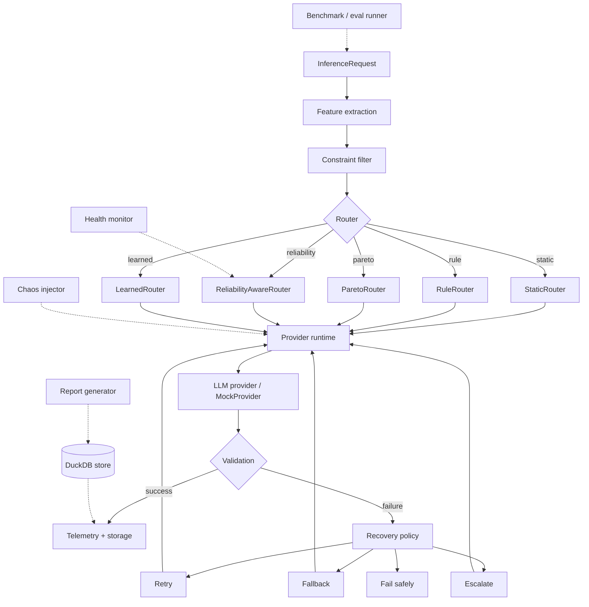

# Architecture

## Overview

ParetoGuard sits between an application and one or more LLM providers. It normalizes
provider behavior, routes each request to a model under explicit constraints, records
what happened, and can inject/recover from faults for evaluation purposes.

## Module boundaries

| Module | Responsibility | Must not do |
|---|---|---|
| `core` | Typed domain models, configuration | Contain business logic |
| `providers` | Normalize provider I/O | Know about routing or evaluation |
| `runtime` | Concurrency, timeout, retry, budget | Know about specific providers |
| `routing` | Select a model given constraints/health | Call providers directly |
| `evals` | Task schemas, grading, benchmark orchestration | Assume a specific router |
| `evals.matrix` | Offline: every candidate x every task, for learned-router training data | Assume a specific router (candidates are given, not chosen) |
| `routing.execution` | **The one exception**: dispatches a `Router`'s `RoutingDecision` to the selected provider via `Runtime` | — (every other file in `routing` still must not call providers; only this one composes `routing` + `evals` + `runtime` for live router-driven benchmarking) |
| `agents` | Tool-use loop, deterministic tools | Execute arbitrary code or shell |
| `chaos` | Deterministic fault injection | Run unconditionally outside experiments |
| `recovery` | Retry/fallback/circuit-breaker/escalation policy | Hide failures silently |
| `telemetry` | Trace events, rolling health metrics | Persist directly to disk (delegates to storage) |
| `storage` | DuckDB schema, migrations, export | Contain domain logic |
| `statistics` | Confidence intervals, comparisons, regression | Be called from CLI/API handlers directly for business decisions |
| `reports` | Render stored results into docs/charts | Compute new metrics not already stored |
| `api` | FastAPI HTTP boundary | Contain business logic |
| `cli` | Typer command boundary | Contain business logic |

CLI and API are thin: they parse input, call into the library modules above, and
format output. This keeps every capability usable both as a library and as a service.

## Data flow for a benchmark run

1. A `BenchmarkRun` is created from an `EvalSuite` + `RunManifest` (captures git SHA,
   seed, config versions).
2. For each `EvalCase`, the runtime builds an `InferenceRequest`, asks the configured
   `Router` for a `RoutingDecision`, and dispatches to the provider runtime.
3. The chaos injector may intercept the request/response to apply a `FaultSpec`
   (deterministic, seeded).
4. Providers return a normalized `InferenceResponse`; graders in `evals` compute an
   `EvalResult`.
5. On failure, the `recovery` module decides retry/fallback/escalate/fail based on the
   error taxonomy.
6. Every step emits `TraceEvent`s to `telemetry`, which updates rolling `ModelHealth`
   and persists to the DuckDB `storage` layer.
7. `reports` reads only from storage to produce Markdown/JSON/chart output — it never
   recomputes metrics from live provider calls.

## Non-goals

No Kubernetes, message queues, or distributed infrastructure. The reliability story is
about the LLM/agent layer (retries, fallbacks, circuit breakers, adaptive routing), not
about distributed systems infrastructure.
